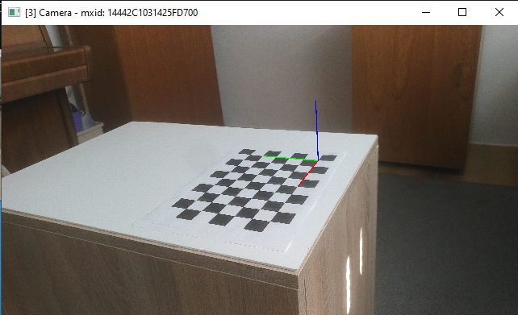

# DepthAI Pointcloud Generation Pipeline
## Installing dependencies

```bash
pip install -r requirements.txt
```

# Pre-trained Models

Download and save them in ```checkpoints/``` directory.

| Model | Params | Checkpoint |
|:-|-:|:-:|
| Depth-Anything-V2-Small | 24.8M | [Download](https://huggingface.co/depth-anything/Depth-Anything-V2-Small/resolve/main/depth_anything_v2_vits.pth?download=true) |
| Depth-Anything-V2-Base | 97.5M | [Download](https://huggingface.co/depth-anything/Depth-Anything-V2-Base/resolve/main/depth_anything_v2_vitb.pth?download=true) |
| Depth-Anything-V2-Large | 335.3M | [Download](https://huggingface.co/depth-anything/Depth-Anything-V2-Large/resolve/main/depth_anything_v2_vitl.pth?download=true) |
| Depth-Anything-V2-Giant | 1.3B | Coming soon |


# Multi camera calibration
This example demonstrates how to compute extrinsic parameters (pose of the camera) for multiple cameras.


## Controls
| key 			| action
| :---			| :---			|
| `1` ... `9` 	| select camera |
| `q`			| quit 			|
| `p`			| compute the pose of the selected camera and save the results |

## Configuration
Properties of the checkerboard used for calibration and the calibration data directory can be changed in the env file.

## Usage
Run the [`main.py`](main.py) with Python 3.

__Measure the pose of the camera__ \
Select the camera. Press the `p` key to estimate the pose of the camera. An overlay showing the coordinate system will appear. To dismiss the overlay press any key. The pose of the camera will be saved to a file (`calibration_data/extrinsics_<camera_mxid>` by default). \
_Repeat for every camera_. 



## How it works
Open CV's [`findChessboardCorners`](https://docs.opencv.org/4.x/d9/d0c/group__calib3d.html#ga93efa9b0aa890de240ca32b11253dd4a) is used to find the checkerboard and [`solvePnP`](https://docs.opencv.org/4.x/d9/d0c/group__calib3d.html#ga549c2075fac14829ff4a58bc931c033d) is used to compute the translation and rotation  from the camera to the checkerboard.


## Interpret the results

The results can be read with Numpy's load function:
```python
import numpy as np
extrinsics = np.load("calibration_data/extrinsics_19443010F1CCF41200.npz")
print("World to cam: \n", extrinsics["world_to_cam"])
print("Cam to world: \n", extrinsics["cam_to_world"])
print("Rotation vector: \n", extrinsics["rot_vec"])
print("Translation vector: \n", extrinsics["trans_vec"])
```

To transform a point from the camera coordinate system to the world coordinate system or vise versa simply multiply a point with the appropriate transformation matrix.
```python
p_cam = np.array([x,y,z,1])
p_world = data["cam_to_world"] @ p_cam
```

To get the position of the camera in the world coordinate system transform all zero vector to wrold space:
```python
camera_pos = data["cam_to_world"] @ np.array([0,0,0,1])
```

> Notice how the points have an extra coordinate. This is called a homogeneous component and enables translation as well as rotation with a single transformation matrix.

### Reproject points to the image
To reproject points written in the world coordinate system to the camera image we need the intrinsic matrix in adition to previously described extrinsic parameters. To get it use:
```python
calibration = dai.Device().readCalibration()
intrinsic_mat = calibration.getCameraIntrinsics(dai.CameraBoardSocket.RGB, width, height)
```
where `width` and `height` represent the image width and height in pixels.
```python
points, _ = cv2.projectPoints(
	np.float64([[x1, y1, z1], [x2, y2, z2], [x3, y3, z3], [x4, y4, z4], ...]), 
	extrinsics["rot_vec"], extrinsics["trans_vec"], intrinsic_mat, None
)
```
resulting `points` contains postions in pixels.


## Point cloud fusion
This example demonstrates how point clouds from different cameras can be merged together.


## Usage
> Before you can run this demo you need to calibrate the cameras. Generate a calibration file for each camera. Make sure that the `calibration_data_dir` in the env is set correctly.

Run the [`main.py`](main.py) with Python 3.
```
python main.py
```

The point clouds might not be aligned perfectly. To refine the alignment press the `a` key. The results will be saved to the `calibration_data_dir` set in the env file. To get the best results perform the alignment porcess on high contrast scene.

The alignment is achieved with the Open3D library ([example](http://www.open3d.org/docs/latest/python_example/pipelines/index.html#colored-icp-registration-py)).

## Controls
| key 			| action
| :---			| :---			|
| `q`			| quit 			|
| `a`			| align pointclouds and save the results |
| `r`			| reset alignment |
| `s`			| save pointclouds to `sample_data` |
| `d`			| toggle depth view |

